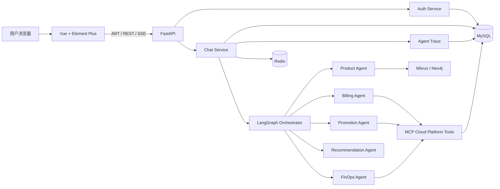
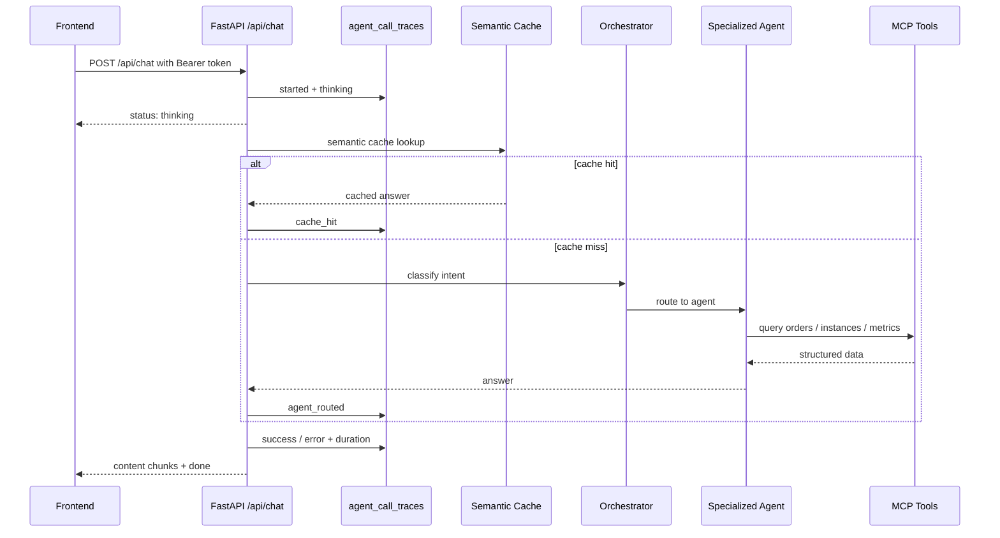

# Cloud Agent 云平台智能客服系统

Cloud Agent 是一个面向云产品咨询、订单账单查询、推广活动和资源优化建议的 Multi-Agent 智能客服项目。项目不是简单的大模型套壳，而是把登录体系、用户隔离、会话持久化、RAG/工具调用、SSE 流式响应和工程化部署串成了一个可运行的完整应用。

## 功能亮点

- 多用户登录：预置 `user_1001`、`user_1002`，密码 `Cloud@123456`，使用 bcrypt + JWT access token + refresh token。
- 会话历史：MySQL 持久化会话和消息，支持切换历史、恢复消息、软删除会话。
- Multi-Agent 路由：Orchestrator 根据意图分发到产品、账单、推广、推荐和 FinOps Agent。
- 工具调用：账单/实例/监控数据通过 MCP 工具查询，避免模型伪造业务数据。
- RAG 与记忆：Redis 维护短期上下文，Milvus/Neo4j 支撑知识检索和产品问答。
- SSE 流式体验：前端实时显示“正在思考 / 正在查询 / 正在调用工具 / 正在生成回答”。
- 可观测性：`agent_call_traces` 记录每次 Agent 调用的用户、会话、阶段、路由结果、耗时和失败原因。
- 工程化：Alembic 版本化 migration、pytest 接口测试、Playwright E2E、Docker Compose 一键运行。

## 技术栈

- 后端：FastAPI、pymysql、Alembic、python-jose、passlib、SSE
- Agent：LangGraph、LangChain、DashScope 兼容 OpenAI SDK、MCP
- 存储：MySQL、Redis、Milvus、Neo4j
- 前端：Vue 3、Element Plus、Vite、Marked、Playwright
- 部署：Docker Compose、Nginx、Uvicorn

## 架构图



## Agent 流程



## 快速启动

### 1. 本地环境启动

```bash
conda activate D:\SoftwareInstallation\Anaconda\envs\cloud_agent
pip install -r agent/requirements.txt
cd front/cloud_agent
npm install
```

复制并填写配置：

```bash
copy agent\.env.example agent\.env
copy front\cloud_agent\.env.example front\cloud_agent\.env.local
```

关键配置：

- `DASHSCOPE_API_KEY`：DashScope 可用 key。
- `JWT_SECRET_KEY`：至少 32 位随机字符串。
- `MYSQL_*`、`REDIS_URL`、`MILVUS_*`、`NEO4J_*`：本地或 Docker 中间件地址。

初始化数据库：

```bash
python -m alembic upgrade head
```

启动后端：

```bash
cd app
python app_main.py
```

启动前端：

```bash
cd front/cloud_agent
npm run dev -- --host 127.0.0.1 --port 5173
```

访问：`http://127.0.0.1:5173`

### 2. Docker Compose 一键启动

```bash
docker compose up --build
```

Compose 会启动 MySQL、Redis、Neo4j、Milvus、FastAPI 和前端 Nginx。前端访问地址：`http://127.0.0.1:5173`。

> 注意：`docker compose config` 会展开本地 `agent/.env`，不要把带真实 key 的输出贴到公开位置。

## 测试账号

| 用户名 | 密码 | 说明 |
|---|---|---|
| `user_1001` | `Cloud@123456` | 企业用户，包含 ECS/RDS/共享带宽订单和低利用率资源数据 |
| `user_1002` | `Cloud@123456` | 个人开发者用户，包含按量 ECS 和云盘订单 |

## API 概览

| 方法 | 路径 | 说明 |
|---|---|---|
| POST | `/api/auth/login` | 登录，返回 access token 和 refresh token |
| POST | `/api/auth/refresh` | 刷新 token，并撤销旧 refresh token |
| POST | `/api/auth/logout` | 登出并撤销 refresh token |
| GET | `/api/auth/me` | 获取当前登录用户 |
| GET | `/api/sessions` | 获取当前用户会话列表 |
| POST | `/api/sessions` | 创建会话 |
| GET | `/api/sessions/{session_id}/messages` | 获取会话消息 |
| DELETE | `/api/sessions/{session_id}` | 软删除会话 |
| POST | `/api/chat` | SSE 流式聊天，返回 `status/content/done/error` 事件 |

## 数据库表

- `users`：登录用户、密码哈希、禁用状态。
- `refresh_tokens`：refresh token 哈希、过期时间、撤销状态。
- `chat_sessions`：用户会话，使用 `deleted_at` 软删除。
- `chat_messages`：每轮 user/assistant 消息。
- `cloud_orders`：模拟云订单和账单数据。
- `cloud_instances`：模拟云资源实例。
- `instance_metrics_daily`：实例近 7 天资源使用率。
- `agent_call_traces`：Agent 调用阶段、路由、耗时和错误。

## 测试命令

后端接口测试：

```bash
python -m pytest tests -q
```

前端构建：

```bash
cd front/cloud_agent
npm run build
```

前端 E2E：

```bash
cd front/cloud_agent
npx playwright install chromium
npm run test:e2e
```

Docker 配置校验：

```bash
docker compose config
```

## 演示用例

完整演示脚本见 [docs/demo-use-cases.md](docs/demo-use-cases.md)。推荐面试展示顺序：

1. 使用 `user_1001` 登录。
2. 提问“帮我查一下我最近的订单记录”，展示账单 Agent 和持久化历史。
3. 提问“获取近7天CPU/内存/带宽数据并做降本建议”，展示 Billing -> FinOps 工作流。
4. 退出后用 `user_1002` 登录，展示会话隔离。
5. 打开数据库 `agent_call_traces`，展示阶段、耗时、路由结果。

## 常见问题

### 页面出现 `????`

优先检查 MySQL 字符集：

```sql
SELECT DEFAULT_CHARACTER_SET_NAME, DEFAULT_COLLATION_NAME
FROM information_schema.SCHEMATA
WHERE SCHEMA_NAME = 'cloud_platform';
```

应为 `utf8mb4` 和 `utf8mb4_unicode_ci`。如果旧库已有乱码数据，重新执行 migration/初始化脚本后再创建新会话。

### `/api/chat` 无响应或 Agent 路由失败

检查：

- `DASHSCOPE_API_KEY` 是否有效且账号未欠费。
- Redis、Milvus、Neo4j、MySQL 是否可连接。
- `agent_call_traces` 中是否记录 `error` 状态和失败原因。

### Playwright 无浏览器

执行：

```bash
cd front/cloud_agent
npx playwright install chromium
```