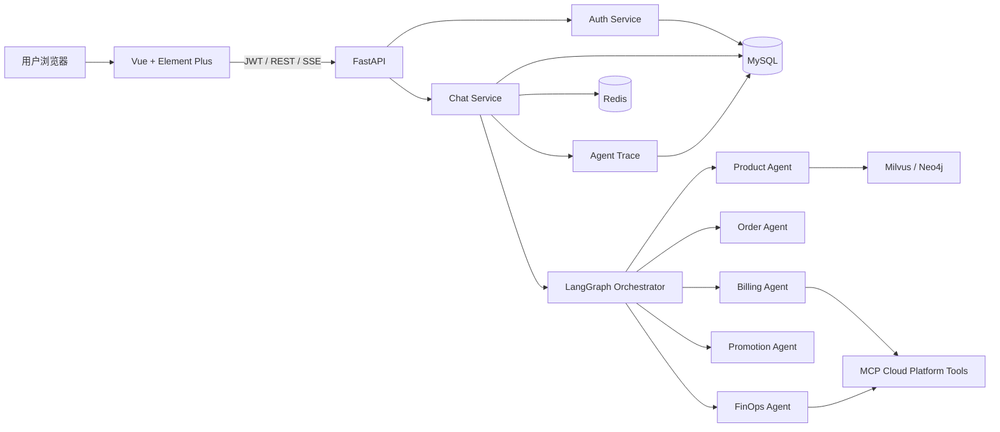
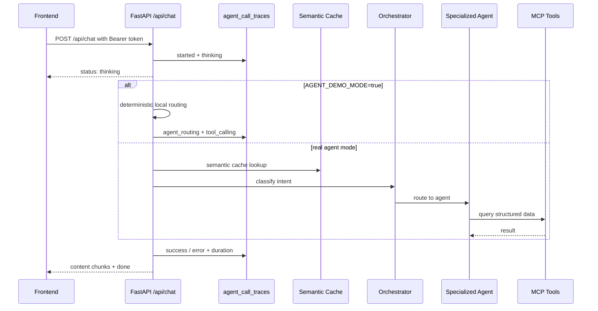

# Cloud Agent 云平台智能客服系统

Cloud Agent 是一个面向云产品咨询、订单/账单查询、推广活动、产品推荐和资源优化建议的 Multi-Agent 智能客服项目。项目把登录体系、用户隔离、会话持久化、SSE 流式响应、Agent 路由、工具调用轨迹、测试、迁移和 Docker Compose 串成了一个可运行的完整应用。

## 功能亮点

- 多用户登录：预置 `user_1001`、`user_1002`，密码 `Cloud@123456`，使用 bcrypt、JWT access token 和 refresh token。
- 会话历史：MySQL 持久化会话和消息，支持历史切换、消息恢复、软删除和用户隔离。
- Multi-Agent 路由：按意图路由到产品问答、订单、账单、推荐、FinOps 等 Agent。
- 稳定演示模式：`AGENT_DEMO_MODE=true` 时不依赖 DashScope、embedding、RAG 或外部 MCP，也能完整演示聊天、SSE、会话和 trace。
- 调用轨迹：后端记录每次请求的阶段、命中 Agent、耗时和失败原因；前端可在“调用轨迹”抽屉中查看。
- 工程化：Alembic migration、pytest 接口测试、Playwright E2E、Agent route eval、Docker Compose 一键启动。

## 技术栈

- 后端：FastAPI、pymysql、Alembic、python-jose、passlib、SSE
- Agent：LangGraph、LangChain、DashScope、MCP
- 存储：MySQL、Redis、Milvus、Neo4j
- 前端：Vue 3、Element Plus、Vite、Marked、Playwright
- 部署：Docker Compose、Nginx、Uvicorn

## 架构图



## Agent 流程



## 快速启动

### 本地启动

```powershell
D:\SoftwareInstallation\Anaconda\envs\cloud_agent\python.exe -m pip install -r agent\requirements.txt
cd front\cloud_agent
npm install
```

复制配置：

```powershell
copy agent\.env.example agent\.env
copy front\cloud_agent\.env.example front\cloud_agent\.env.local
```

关键配置：

- `JWT_SECRET_KEY`：至少 32 位随机字符串。
- `DASHSCOPE_API_KEY`：真实 Agent 模式需要可用 key。
- `AGENT_DEMO_MODE=true`：推荐本地演示开启，避免 DashScope SSL、代理、欠费等问题影响展示。
- `MYSQL_*`、`REDIS_URL`、`MILVUS_*`、`NEO4J_*`：本地或 Docker 中间件地址。

初始化数据库：

```powershell
D:\SoftwareInstallation\Anaconda\envs\cloud_agent\python.exe -m alembic upgrade head
```

启动后端：

```powershell
cd app
D:\SoftwareInstallation\Anaconda\envs\cloud_agent\python.exe app_main.py
```

启动前端：

```powershell
cd front\cloud_agent
npm run dev -- --host 127.0.0.1 --port 5173
```

访问：`http://127.0.0.1:5173`

### Docker Compose

```bash
docker compose up --build
```

Compose 会启动 MySQL、Redis、Neo4j、Milvus、FastAPI 和前端服务。不要把包含真实 key 的 `agent/.env` 或 `docker compose config` 输出提交到仓库。

## 测试账号

| 用户名 | 密码 | 说明 |
|---|---|---|
| `user_1001` | `Cloud@123456` | 企业用户演示账号 |
| `user_1002` | `Cloud@123456` | 隔离验证账号 |

## API 概览

| 方法 | 路径 | 说明 |
|---|---|---|
| POST | `/api/auth/login` | 登录，返回 access token 和 refresh token |
| POST | `/api/auth/refresh` | 刷新 token，并撤销旧 refresh token |
| POST | `/api/auth/logout` | 登出并撤销 refresh token |
| GET | `/api/auth/me` | 获取当前登录用户 |
| GET | `/api/sessions` | 获取当前用户会话列表 |
| POST | `/api/sessions` | 创建会话 |
| GET | `/api/sessions/{session_id}/messages` | 获取会话消息 |
| DELETE | `/api/sessions/{session_id}` | 软删除会话 |
| GET | `/api/sessions/{session_id}/traces` | 获取当前用户指定会话的调用轨迹 |
| GET | `/api/traces/recent?limit=20` | 获取当前用户最近调用轨迹 |
| POST | `/api/chat` | SSE 流式聊天，返回 `status/content/done/error` 事件 |

## 数据库表

- `users`：登录用户、密码哈希、禁用状态。
- `refresh_tokens`：refresh token 哈希、过期时间、撤销状态。
- `chat_sessions`：用户会话，使用 `deleted_at` 软删除。
- `chat_messages`：每轮 user/assistant 消息。
- `cloud_orders`：模拟云订单和账单数据。
- `cloud_instances`：模拟云资源实例。
- `instance_metrics_daily`：实例近 7 天资源使用率。
- `agent_call_traces`：Agent 调用阶段、路由、耗时和错误。

## 测试命令

后端接口测试：

```powershell
D:\SoftwareInstallation\Anaconda\envs\cloud_agent\python.exe -m pytest tests -q
```

Agent 路由评测：

```powershell
D:\SoftwareInstallation\Anaconda\envs\cloud_agent\python.exe -m evals.run_agent_evals
```

前端构建：

```powershell
cd front\cloud_agent
npm run build
```

前端 E2E：

```powershell
cd front\cloud_agent
npx playwright install chromium
npm run test:e2e
```

## 演示建议

完整脚本见 [docs/demo-use-cases.md](docs/demo-use-cases.md)。推荐演示顺序：

1. 设置 `AGENT_DEMO_MODE=true`，保证演示稳定。
2. 用 `user_1001` 登录，发送订单查询、账单查询、产品推荐和资源优化问题。
3. 打开前端“调用轨迹”，展示路由 Agent、阶段状态和耗时。
4. 刷新页面后展示会话历史仍然存在。
5. 退出后用 `user_1002` 登录，展示用户会话隔离。
6. 运行 `python -m evals.run_agent_evals`，展示 Agent 路由评测 5/5 通过。

## 常见问题

### 页面出现 `????`

检查 MySQL 字符集：

```sql
SELECT DEFAULT_CHARACTER_SET_NAME, DEFAULT_COLLATION_NAME
FROM information_schema.SCHEMATA
WHERE SCHEMA_NAME = 'cloud_platform';
```

应使用 `utf8mb4`。如果旧库已有乱码数据，重新执行 migration 或初始化脚本后再创建新会话。

### `/api/chat` 返回 Connection error

通常是 DashScope 网络、SSL、代理或账号状态问题。演示时建议先设置：

```env
AGENT_DEMO_MODE=true
```

真实 Agent 联调时再切回：

```env
AGENT_DEMO_MODE=false
```

### Trace 表没有数据

先确认已执行：

```powershell
D:\SoftwareInstallation\Anaconda\envs\cloud_agent\python.exe -m alembic upgrade head
```

再发起一次聊天请求，然后查看前端“调用轨迹”或查询 `agent_call_traces`。
